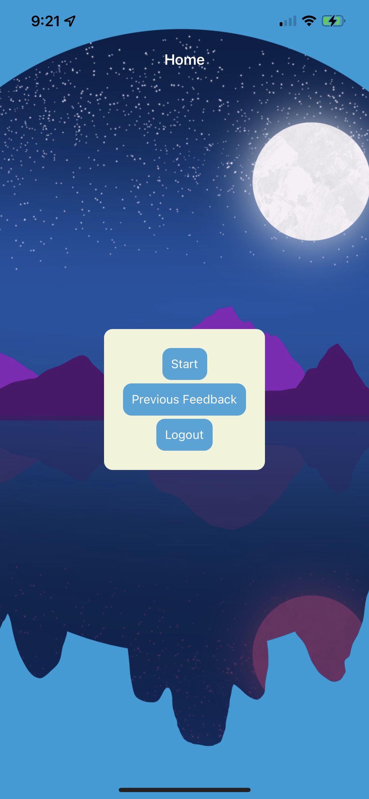
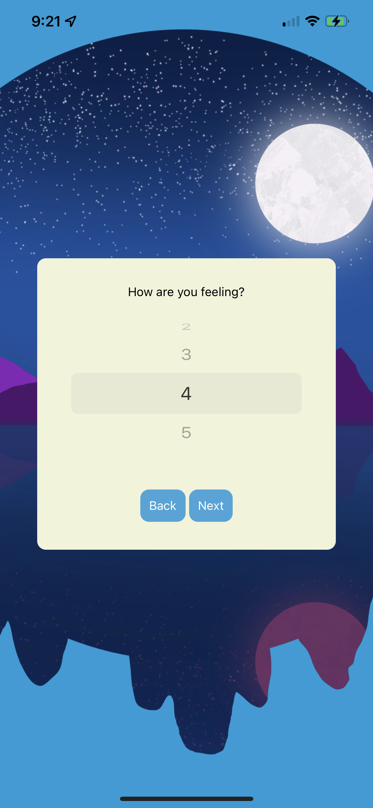
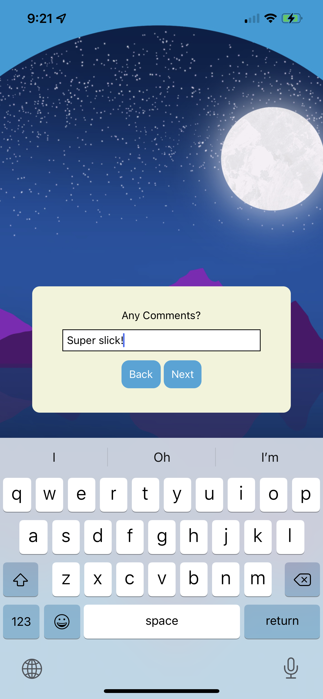
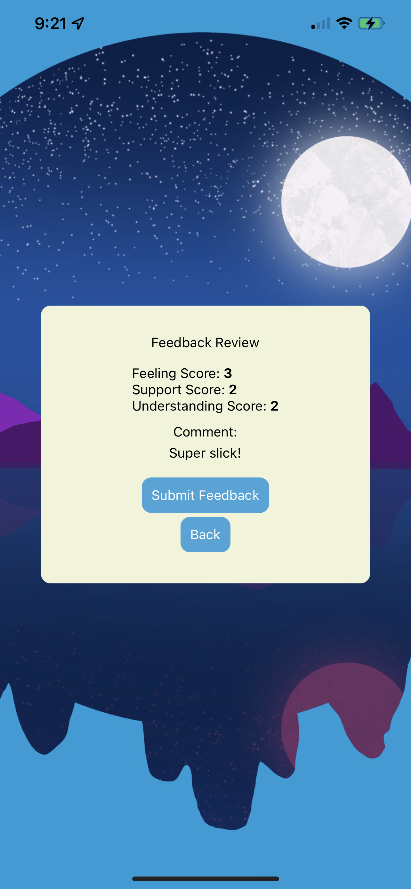
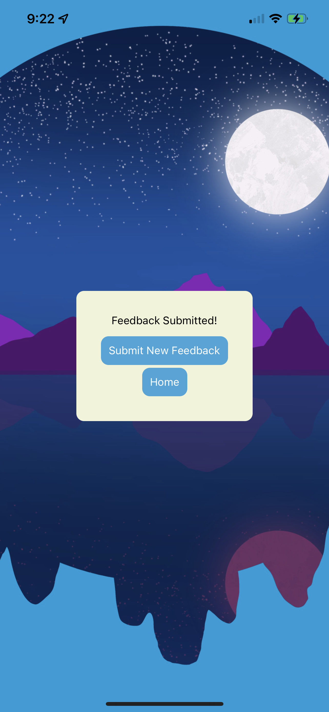
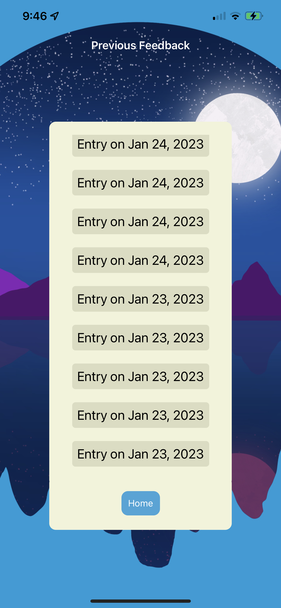
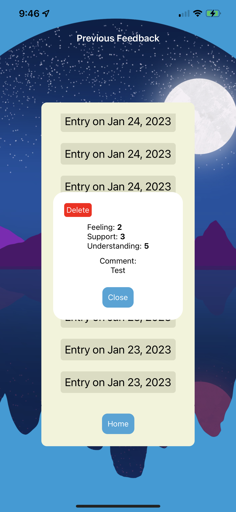

# React Native Feedback Loop

## Description

The React Native Feedback Loop is essentially a port of a web app I made previously called the [Feedback Survery](https://github.com/TheDaveWave/Feedback-Survey) to a React-Native application.

This application is meant to emulate a form / feedback loop. The user may fill out inputs throughout the form and store their responses onto a database. This particular form is meant to gauge how someone is doing over a period of time while in a learning environment. 

## Preview

## Usage

1. From the Home page the user can tap `Start` to start a feedback form, `Previous Feedback` to view their previous entries, or `Logout` to logout of the application.

The gauges mentioned are choices between 1 meaning terrible, and 5 meaning excellent.

2. The user may fill out the form starting with the `feeling` page. Here the user may select a number from one to five and then     select the `next` button.
    
    

3. The next two pages will have the same gauge but measure level of `understanding` and level of `support` navigable through the use of the `next` and `back` buttons.

4. On the fourth page the user may enter in an optional `comment` for the day.

    

5. After choosing to enter a comment or not the user will be directed to the `review` page.
    - Here the selections for each part of the form are shown.
    

6. On the `review` page the user may select `submit` to submit the form to the database.
    - Selecting the `submit` button the success screen will appear and the feedback will be added to the database. The success screen will have two buttons.
    
    - Selecting `Submit New Feedback` will allow the user to submit another form.
    - Selecting `Home` will redirect the user back to the Home screen.

7. On the Home screen, the user can tap `Previous Feedback` to be directed to the Previous Feedback Screen.
    - Here the user can see a list of their previous entries.
    
    - The user can `long-press` an entry to see a modal with the entry information and a `delete` button to delete the entry.
    

## Prerequisites

Can't forget these:

-[node js](https://nodejs.org/en/)

-[npm](https://docs.npmjs.com/)

## Built With

-[React](https://reactjs.org/)

-[React-Redux](https://react-redux.js.org/)

-[React-Native](https://reactnative.dev/docs/environment-setup)

-[React-Native-Expo](https://expo.dev/)

-[JWT](https://jwt.io/)

-[Postgres](https://www.postgresql.org/)

## Setup

1. Must have a `.env` file setup with at least two variables:
    - JWT_SECRET_KEY
    - TOKEN_HEADER_KEY

2. In the [config.js](config.js) file setup the `BASE_URL` variable to whatever the `ip address` of your devices is plus the `port` the server is running on, if you are running the server locally like in this project.

3. Setup a database named `native_feedback` and use the create table statements from the [database.sql](database.sql) file.

## Acknowledgement

Thanks to Nathaniel Moy for supplying me with an awesome background image.

## Support
If you have any questions, suggestions, or issues, please email me at [david.wesley.lindberg@gmail.com](www.google.com)